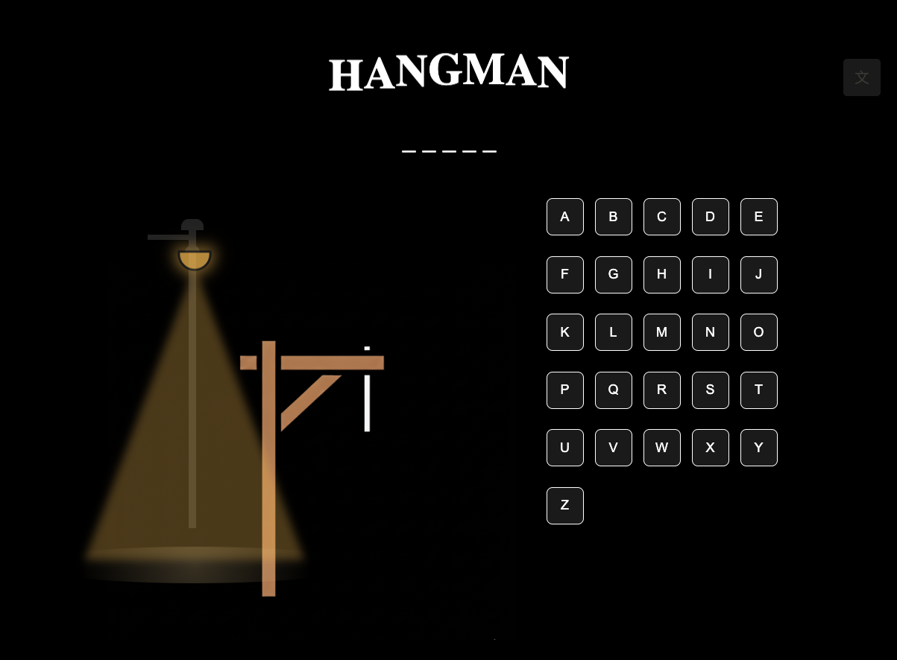
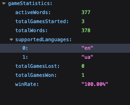
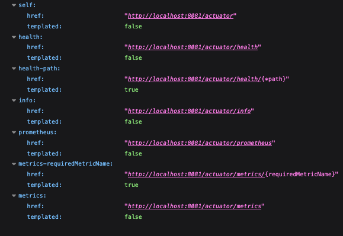

# Hangman Game - Multilingual Web Application

_A modern, multilingual Hangman game build with Spring Boot, following
Domain-Driven Design (DDD) principles and SOLID architecture patterns.
The game supports multiple languages, categories, difficulty levels, and
provides both REST API and web interface._
---

## Features

*Core Game Features*

    - Multilingual Support: 
        * English
        * Ukrainian
        * German
        * French
        * Spanish

    - Category-based Words:
        * Programming
        * Animals
        * Technology
        * General

    - Difficulty Levels:
        * Easy (3-4 letters)
        * Medium (5-7 letters)
        * Hard (8+ letters)

    - Language-specific Validation: 
        * Proper alphabet validation for each language

    - Virtual Keyboard:
        * Adaptive keyboard based on selected language

    - Real-time Game State: Session-based game persistence
*Technical Features*

    - Domain-Driven Design (DDD) architecture
    - SOLID Principles implementation
    - Clean Architecture with separated layers
    - RESTful API with comprehensive endpoints
    - JPA/Hibernate with H2 (dev) and PostgreSQL (prod) support
    - Multilingual Word Management system
    - File-based Word Loading with validation
    - Comprehensive Error Handling
    - Logging and Monitoring
    - HTML | CSS | JS | Liquibase | Prometheus | Grafana | Spring Boot Actuator

## 🏗️ Architecture
*domain layer*
```bash
domain/
├── aggregate/
│   └── HangmanGame.java          # Main game aggregate
├── model/
│   └── Word.java                 # Word entity
├── valueobject/
│   ├── Language.java             # Language value object
│   ├── GamePreferences.java      # Game configuration
│   ├── Letter.java               # Letter validation
│   └── GameId.java               # Game identifier
├── event/
│   ├── GameStartedEvent.java     # Domain events
│   ├── LetterGuessedEvent.java
│   └── GameEndedEvent.java
├── exception/
│   ├── GameNotFoundException.java
│   ├── UnsupportedLanguageException.java
│   └── LetterAlreadyGuessedException.java
└── repository/
    ├── WordRepository.java       # Domain repository interfaces
    └── GameRepository.java
```

*application layer*
```bash
application/
├── service/
│   ├── HangmanGameService.java   # Main game service
│   └── WordManagementService.java # Word administration
└── dto/
    ├── GameDto.java              # Data transfer objects
    ├── GuessDto.java
    └── LanguageInfoDto.java
```
*infrastructure layer*
```bash
infra
├── entity/
│   └── WordEntity.java           # JPA entities
├── repository/
│   ├── jpa/
│   │   └── WordJpaRepository.java # JPA repositories
│   └── impl/
│       ├── JpaWordRepository.java # Repository implementations
│       └── InMemoryGameRepository.java
└── service/
    └── WordLoaderService.java    # File loading service
```
*controller layer*
```bash
controller/
├── HangmanController.java        # Main game API
├── HomeController.java           # Web interface
├── WordManagementController.java # Admin API
└── LanguageManagementController.java
```

## 🚀 Quick Start

Prerequisites

- Java 17 or later
-  Maven 3.6+
- (Optional) PostgreSQL for production

### Installation
1. Clone repo
```courseignore
git@github.com:dramaticLemon/hangman-web.git
cd hangman-web
```
2. Build the project
```courseignore
filled .env 
    DB_PASSWORD=******
    DB_USER=********** 
mvn clean install
```
3. Run the application
```courseignore
make rebuild
```
4. Access the application
   - Web Interface: http://localhost:8081/api/game

## 🌍 Language Support
| Language | Code | Alphabet | Sample Words |
| :--- | :---: | :---: | :--- |
| English | `en` | Latin | computer, algorithm, spring |
| Ukrainian | `uk` | Cyrillic | комп'ютер, алгоритм, програма |
---
### Adding New Languages
1. Create ford files:
```bash
src/main/resources/words/[language]/
├── general-words.txt
├── programming-words.txt
└── animals-words.txt
```
2. Update Language enum: 
``` java
// Add to Language.java
private static final Set<String> SUPPORTED_LANGUAGES = Set.of(
    "en", "ru", "de", "fr", "es", "it", "pt" // Add new language code
);
```
3. Add validation patterns:
```java
// Add to WordLoaderService.java
validationPatterns.put("it", Pattern.compile("^[a-zA-Zàèéìíîòóù]{3,50}$"));
```
## 📡 API Endpoints
*Game Management*
```bash
POST /api/hangman/start
POST /api/hangman/start-with-preferences?language=en&category=programming&difficulty=medium
POST /api/hangman/guess?letter=a
GET  /api/hangman/status
DELETE /api/hangman/end
```
*Language Support*
```bash
GET /api/hangman/languages
GET /api/hangman/languages/{languageCode}
```
*Admin Endpoints*
```bash
GET    /api/admin/words/stats
POST   /api/admin/words/{lang}/upload
POST   /api/admin/words/add?word=example&category=general&language=en
DELETE /api/admin/words/{word}
GET    /api/admin/words/exists/{word}
POST   /api/admin/words/reload
```

*Admin curl endpoints*
```bash
curl --location 'http://localhost:8081/api/admin/words/stats
```
```bash
curl --location 'http://localhost:8081/api/admin/words/en/upload' \
--form 'file=@"postman-cloud:///1f09a900-1517-4890-9784-b9bea74e24ec"' \
--form 'category="general»’
```
```bash
curl --location 'http://localhost:8081/api/admin/words/add-word' \
--header 'Cookie: JSESSIONID.e0c0fec3=node0b8dffhjmr5a71r4wewxma9a0q15.node0' \
--form 'word="orange"' \
--form 'category="fruits"' \
--form 'language="en»'
```
```bash
curl --location --request DELETE 'http://localhost:8081/api/admin/words/apple' \
--header 'Cookie: JSESSIONID.e0c0fec3=node0b8dffhjmr5a71r4wewxma9a0q15.node0' \
--form 'language="en»'
```
```bash
curl --location --request GET 'http://localhost:8081/api/admin/words/exists/apple' \
--header 'Cookie: JSESSIONID.e0c0fec3=node0b8dffhjmr5a71r4wewxma9a0q15.node0' \
--form 'language="en»'
```
### Example API Usage
*Start a new game in English:*
```bash
curl -X POST "http://localhost:8081/api/hangman/start?language=en"
```
```json
{
    "language": "en",
    "remainingTries": 6,
    "currentState": "_______",
    "message": "Game started successfully",
    "status": "IN_PROGRESS"
}
```

*Guess a letter:*
```bash
curl -X POST "http://localhost:8081/api/hangman/guess" --data-urlencode "letter=а"
```
```json
{
    "wasCorrect": false,
    "language": "en",
    "remainingTries": 5,
    "currentState": "______",
    "status": "IN_PROGRESS"
}

```

Response:
```json
{
  "currentState": "p_o___mm___",
  "currentStateWithSpaces": "p _ о _ _ _ m m _ _ _",
  "remainingTries": 5,
  "status": "IN_PROGRESS",
  "language": "en",
  "wasCorrect": true,
  "guessedLetter": "а",
  "allGuessedLetters": ["p", "g"],
  "message": "Correct!"
}
```
## 🗄️ Database Schema
*Words Table*
```SQL
CREATE TABLE words (
    id BIGINT GENERATED BY DEFAULT AS IDENTITY PRIMARY KEY,
    content VARCHAR(50) NOT NULL,
    language VARCHAR(5) NOT NULL,
    length INTEGER NOT NULL,
    category VARCHAR(30),
    difficulty_level VARCHAR(50),
    created_at TIMESTAMP DEFAULT CURRENT_TIMESTAMP,
    updated_at TIMESTAMP DEFAULT CURRENT_TIMESTAMP,
    is_active BOOLEAN DEFAULT TRUE
);-- index value & language
CREATE UNIQUE INDEX uk_word_language ON words (content, language);

-- indexes for frequently used fields
CREATE INDEX idx_word_length ON words (length);
CREATE INDEX idx_word_category ON words (category);

-- composite index
CREATE INDEX idx_word_language_category ON words (language, category);
CREATE INDEX i
```
*Indexes*
- idx_word_language on language
- idx_word_language_category on (language, category)
- idx_word_active_language on (is_active, language)

## 📝 Configuration
*Production (PostgreSQL):*
```properties
spring.datasource.url=jdbc:postgresql://postgres-container:5432/hangman
spring.datasource.username=${DB_USER}
spring.datasource.password=${DB_PASSWORD}
spring.datasource.driver-class-name=org.postgresql.Driver

spring.jpa.hibernate.ddl-auto=update
spring.jpa.show-sql=true
spring.jpa.properties.hibernate.dialect=org.hibernate.dialect.PostgreSQLDialect

```
*Develop (H2)*
```properties
spring.datasource.url=jdbc:h2:mem:hangmandb;DB_CLOSE_DELAY=-1;DB_CLOSE_ON_EXIT=FALSE;MODE=PostgreSQL
spring.datasource.driverClassName=org.h2.Driver
spring.datasource.username=sa
spring.datasource.password=
spring.jpa.database-platform=org.hibernate.dialect.H2Dialect
spring.jpa.hibernate.ddl-auto=update
spring.jpa.show-sql=true
spring.h2.console.enabled=true
spring.h2.console.path=/h2-console
```
## 🧪 Testing
*Run Tests*
``` bash
# Run all tests
mvn test

# Run specific test class
mvn test -Dtest=HangmanGameServiceTest

# Run integration tests
mvn integration-test
```
*Test Coverage*
```
mvn jacoco:report
```

## 📊 Word File Format
``` bash
Basic Format
# Comments start with #
# Category: general
# Language: en

# Easy words
cat
dog
sun

# Medium words
computer
keyboard
internet

# Hard words
programming
architecture
development
```

## 🛠️ Development
*Running in Development Mode*
```bash
# With hot reload
mvn spring-boot:run -Dspring-boot.run.profiles=dev

# With debug
mvn spring-boot:run -Dspring-boot.run.jvmArguments="-agentlib:jdwp=transport=dt_socket,server=y,suspend=n,address=5005"
```
### Adding New Features

1. Domain First: Start with domain model
2. Test-Driven: Write tests before implementation
3. API Design: Design REST endpoints
4. Database Migration: Create liquibase scripts
5. Frontend Integration: Update JavaScript client

### Code Style

* Follow Google Java Style Guide
* Use meaningful variable names
* Document public APIs
* Write comprehensive tests

### 🔧 Production Deployment
*Docker Support*
```docker
FROM eclipse-temurin:17-jdk
WORKDIR /app
COPY target/*.jar app.jar
ENTRYPOINT ["java", "-jar", "app.jar"]

```
*Build and Deploy*
```bash
make rebuild
# see also Makefile (other cmd)
```
*Environment Variables*
```properties
DB_USERNAME=test
DB_PASSWORD=test
GF_PASSWORD=test
```
## 📈 Monitoring and Logging

* /actuator/health - Application health
* /actuator/metrics - Application metrics
* /actuator/info - Application info




### Logging Configuration
``` yml
logging:
    level:
        com.join.tab: DEBUG
        org.springframework.web: INFO
        org.hibernate.SQL: DEBUG
    pattern:
        console: "%d{HH:mm:ss.SSS} [%thread] %-5level %logger{36} - %msg%n"
```

## 🤝 Contributing

1. Fork the repository
2. Create a feature branch (git checkout -b feature/new-language)
3. Commit your changes (git commit -am 'Add Italian language support')
4. Push to the branch (git push origin feature/new-language)
5. Create a Pull Request

## Development Guidelines

* Follow DDD principles
* Maintain SOLID architecture
* Write comprehensive tests
* Update documentation
* Add language-specific word files

## 📄 License
This project is licensed under the MIT License - see the [text](LICENSE) file for details.


## 🙏 Acknowledgments

* Spring Boot team for the excellent framework
* Contributors to the multilingual word datasets
* Community feedback and suggestions

## 📞 Support

For questions, issues, or contributions:

* Create an Issue
* Start a Discussion
* Contact: chebandima27@gmail.com
